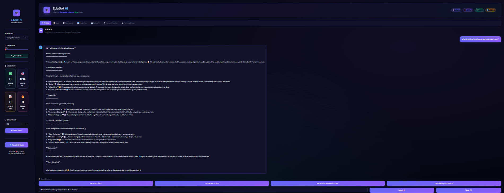
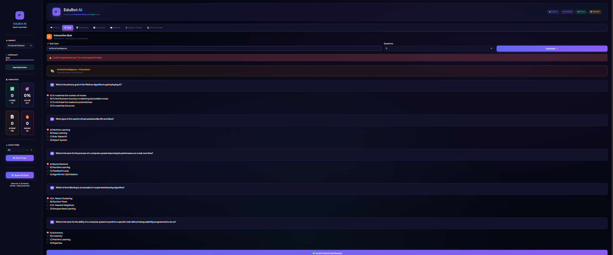
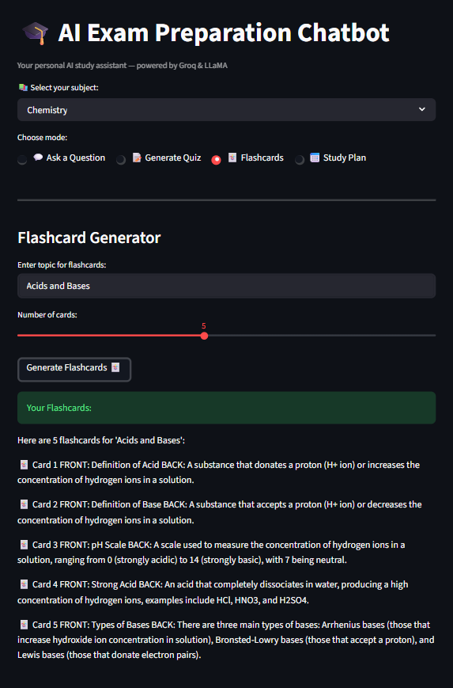
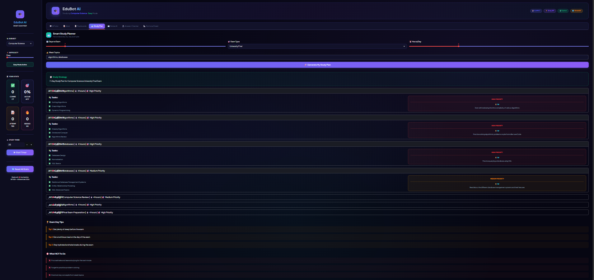

<div align="center">


<br/>

[](https://python.org)
[](https://streamlit.io)
[](https://console.groq.com)
[](https://llama.meta.com)
[](LICENSE)
[](https://github.com/Harshi1409/ai-exam-chatbot)

<br/>

> ### 🎓 An advanced AI-powered exam preparation web application
> Built with Python, Groq API, LLaMA 3, and Streamlit — featuring **7 AI-powered study modes**, real-time progress tracking, and a beautiful dark UI.

<br/>

[✨ Features](#-features) · [📸 Screenshots](#-screenshots) · [🚀 Quick Start](#-quick-start) · [🛠 Tech Stack](#-tech-stack) · [🧠 AI Concepts](#-ai-concepts-used) · [👩‍💻 About](#-about)

<br/>

</div>

---

## 📸 Screenshots

<table>
  <tr>
    <td align="center"><strong>💬 AI Tutor with Memory</strong></td>
    <td align="center"><strong>📝 Interactive Quiz Mode</strong></td>
  </tr>
  <tr>
    <td></td>
    <td></td>
  </tr>
  <tr>
    <td align="center"><strong>🃏 Smart Flashcards</strong></td>
    <td align="center"><strong>📅 Study Planner</strong></td>
  </tr>
  <tr>
    <td></td>
    <td></td>
  </tr>
</table>

---

## ✨ Features

<table>
<tr>
<td width="50%" valign="top">

### 💬 AI Tutor with Memory
- Remembers full conversation like ChatGPT
- Subject-specific intelligent responses
- One-click quick question suggestions
- **4 difficulty levels** — Easy / Medium / Hard / Expert

### 📝 Interactive Quiz Mode
- Auto-generates MCQ questions on any topic
- Click options → get instant feedback
- Detailed explanation for every answer
- Real-time score tracking + accuracy %
- **Auto weak topic detection**

### 🃏 Smart Flashcards
- Beautiful 2-column card layout
- Easy / Medium / Hard difficulty ratings
- Filter cards by difficulty level
- Category tags for organized studying

### 📖 Notes AI — 6 Processing Modes
- 📋 Summarize in simple words
- ❓ Generate exam questions from notes
- 💡 Explain all difficult concepts
- 🔑 Extract key points & formulas
- 🔗 Create mind map structure
- 📝 Make short revision notes

</td>
<td width="50%" valign="top">

### 📅 Smart Study Planner
- Personalized **day-by-day schedule**
- High / Medium / Low priority levels
- Daily study tips & resource suggestions
- Exam day tips + "What NOT to do" list

### 🔬 AI Answer Checker
- Write your exam answer
- **AI grades it out of 10** like a real teacher
- Detailed feedback on what was missing
- Model answer + tips to improve

### 📐 Formula & Concept Sheet Generator
- Instant formula sheets for any topic
- All formulas, definitions, units
- Common mistakes highlighted

### 📊 Built-in Progress Dashboard
- Real-time accuracy tracking
- Total questions attempted counter
- Study session tracker
- **Weak topics auto-detection**
- Built-in **Pomodoro study timer**

</td>
</tr>
</table>

---

## 🛠 Tech Stack
╔══════════════════════════════════════════════════════╗
║              EduBot AI — Architecture                ║
╠══════════════════════════════════════════════════════╣
║  AI Model    →  LLaMA 3.1 8B Instant (Meta)         ║
║  AI API      →  Groq API (Free Tier)                 ║
║  Backend     →  Python 3.12                          ║
║  Frontend    →  Streamlit Web Framework              ║
║  Data        →  JSON Parsing & Session State         ║
║  Dev Env     →  Jupyter Notebook                     ║
║  Portfolio   →  GitHub                               ║
╚══════════════════════════════════════════════════════╝

| Technology | Purpose |
|:---:|:---|
|  **Python 3.12** | Core programming language for all logic and API calls |
|  **Streamlit** | Web application framework — no HTML/CSS needed |
| ⚡ **Groq API** | Free AI inference API with ultra-fast LLM responses |
| 🦙 **LLaMA 3.1 8B Instant** | Open-source Large Language Model by Meta |
| 📦 **JSON** | Structured response parsing for quizzes, plans, cards |
| 🐙 **GitHub** | Version control and open-source portfolio hosting |

---

## 🧠 AI Concepts Used

```python
AI Concepts Applied in EduBot AI:
├── 🤖 Large Language Models (LLM)
│       └── LLaMA 3.1 by Meta — open-source, 8B parameters
│
├── ✍️  Prompt Engineering
│       └── Custom system prompts per mode, subject & difficulty
│
├── 🔌 API Integration
│       └── REST API calls via Groq Python SDK
│
├── 🧵 Conversation Memory
│       └── Chat history maintained for context-aware responses
│
├── 📦 JSON Response Parsing
│       └── Structured AI outputs for quizzes, flashcards, plans
│
└── 🎯 Generative AI
        └── Unique personalized content generated every session
```

---

## 📚 Supported Subjects (40+)

<details>
<summary>📖 Click to see all supported subjects</summary>

<br/>

| Category | Subjects |
|---|---|
| 🔬 **Science** | Physics, Chemistry, Biology, Environmental Science, Biotechnology |
| 📐 **Mathematics** | Mathematics, Statistics, Engineering Mathematics |
| 💻 **Computer Science** | CS, Data Structures & Algorithms, Database Management, Operating Systems, Computer Networks, AI, Machine Learning, Web Development |
| 💼 **Commerce** | Accountancy, Business Studies, Economics |
| 📖 **Humanities** | History, Geography, Political Science, Psychology, Sociology, Philosophy |
| 🔤 **Languages** | English Literature, Hindi, English Grammar |
| ⚙️ **Engineering** | Mechanics, Thermodynamics, Electronics, Circuit Theory |
| 🎓 **Other** | Law, Medical, + **Custom subject input** for anything else |

</details>

---

## 🚀 Quick Start

### Prerequisites
- Python 3.8 or above installed
- Free Groq API key from [console.groq.com](https://console.groq.com)

### Installation

**1. Clone the repository**
```bash
git clone https://github.com/Harshi1409/ai-exam-chatbot.git
cd ai-exam-chatbot
```

**2. Install dependencies**
```bash
pip install groq streamlit
```

**3. Get your free API key**

Go to 👉 [console.groq.com](https://console.groq.com) → Sign up free → API Keys → Create Key

**4. Add your API key**

Open `exambot.py` and replace line 7:
```python
# Replace this
client = Groq(api_key="YOUR_GROQ_API_KEY_HERE")

# With your actual key
client = Groq(api_key="gsk_your_actual_key_here")
```

**5. Run the app**
```bash
streamlit run exambot.py
```

**6. Open in browser**
http://localhost:8501

---

## 🔄 How It Works
👩‍🎓 Student Input (question / topic / notes)
│
▼
🌐 Streamlit Web Interface
└── Captures input from selected tab
│
▼
🐍 Python Backend
└── Builds smart prompt using Prompt Engineering
└── Manages chat history for memory
│
▼
⚡ Groq API Request (REST call)
│
▼
🦙 LLaMA 3.1 Model
└── Processes prompt
└── Generates AI response (quiz/answer/plan/flashcards)
│
▼
📦 JSON Parsing
└── Extracts structured data from response
│
▼
📊 Beautiful UI Display
└── Score tracking updated
└── Weak topics detected
└── Progress dashboard refreshed

---

## 📁 Project Structure
ai-exam-chatbot/
│
├── 📄 exambot.py          ← Complete application (all 7 features)
├── 📄 README.md           ← Project documentation
│
├── 🖼️  home.png           ← Screenshot: AI Tutor
├── 🖼️  quiz.png           ← Screenshot: Quiz Mode
├── 🖼️  flashcards.png     ← Screenshot: Flashcards
└── 🖼️  studyplan.png      ← Screenshot: Study Plan

---

## 📈 Project Highlights

| Feature | Detail |
|---|---|
| 🎯 Study Modes | 7 complete AI-powered modes in one app |
| 📚 Subjects | 40+ subjects + custom subject input |
| 🤖 AI Model | LLaMA 3.1 — same family as ChatGPT competitor |
| ⚡ Response Time | Under 3 seconds per AI response via Groq |
| 💰 Cost | Completely free — no paid API required |
| 📊 Progress | Real-time score, accuracy, session tracking |
| 🎨 Design | Premium dark UI with gradient design system |
| 🧠 AI Skill | Prompt Engineering applied across all 7 modes |

---

## 🎯 Who Can Use This

| User | Use Case |
|---|---|
| 📚 University Students | Quiz practice, study plans, answer checker before exams |
| 🎓 Board Exam Students | Flashcards, MCQs, notes summarizer for quick revision |
| 💼 Competitive Aspirants | Hard/Expert difficulty quizzes, formula sheets |
| 👨‍🏫 Teachers | Auto-generate quiz questions for any topic instantly |
| 🧑‍💻 CS Students | Practice DSA, DBMS, OS, AI concepts with AI tutor |

---

## 💼 CV Description

> **EduBot AI — Advanced Exam Preparation Chatbot** | Python · Groq API · LLaMA 3 · Streamlit
>
> Built a full-stack AI-powered web application featuring 7 study modes — AI tutor with conversation memory, interactive quiz generator, smart flashcards, personalized study planner, notes AI with 6 processing modes, answer checker with grading, and formula sheet generator. Implemented real-time progress tracking, weak topic detection, and Pomodoro timer. Applied Prompt Engineering with LLaMA 3.1 (8B) via Groq API. Deployed as Streamlit web app and published on GitHub.

---

## 👩‍💻 About

**Harshita**
- 🎓 Student — INT428 Artificial Intelligence Essentials
- 💻 Built this project from scratch as a complete beginner
- 🚀 First AI project — turned into a production-grade web app
- 🔗 GitHub: [@Harshi1409](https://github.com/Harshi1409)

---

## 📜 License

This project is open source under the [MIT License](LICENSE) — free to use for educational purposes.

---

<div align="center">


**⭐ If this project helped you, please give it a star! ⭐**

<br/>

Made with ❤️ and lots of ☕ by **Harshita**

*INT428 — Artificial Intelligence Essentials · 2026*

</div>
